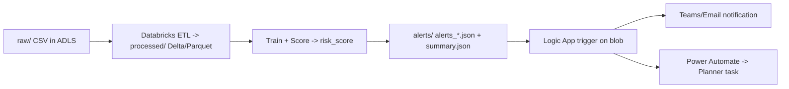

```md
# Azure PdM C-MAPSS Alert Pipeline

Scalable workflow for predictive maintenance alerts: data lake ingestion, Databricks scoring, automated notifications, and Planner task creation (Azure).

## What “done” looks like
1. CSV lands in ADLS Gen2: `/raw/cmapss/...`
2. Databricks cleans + writes Delta/Parquet to `/processed/...`, trains a baseline model, scores newest batch
3. Databricks writes `alerts_*.json` (high-risk rows only) + `summary_*.json` to `/alerts/...`
4. Logic App triggers on new alert file and sends Teams/email notification
5. Power Automate creates a Planner task: “Check Machine X…”

## Architecture
